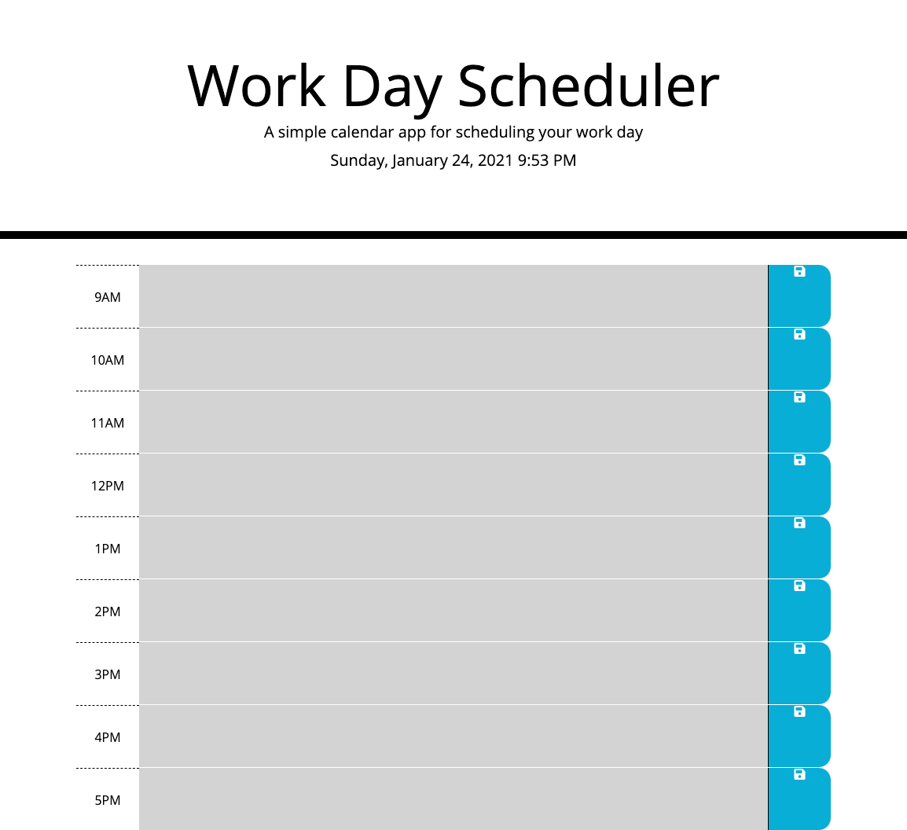

# Work Day Scheduler Starter Code
This single page web application displays the current date at the top and allows the users to input their own daily work schedule into the available time slots.  The user can save their schedule using local storage via the save button for each task and the time slots are color coded so that it is readily apparent where the user is in their day.

## Deployed Page
https://paulkup.github.io/dayPlanner/

## Finished Website
